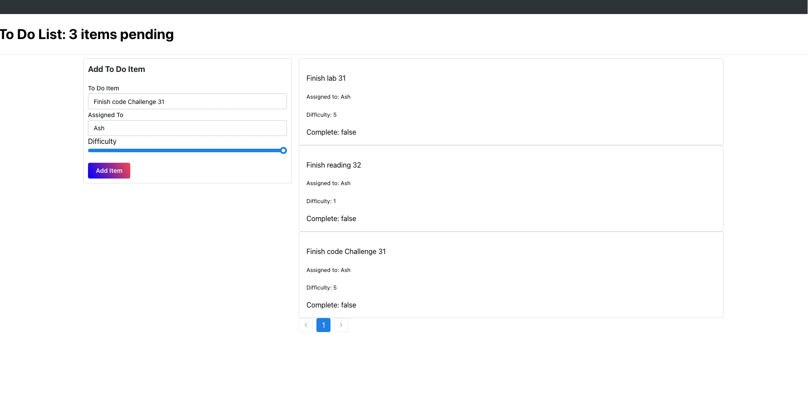

#### lab 31

To-do list

#### Technical Requirements / Notes

implement the React context API for defining settings across the entire application.
  Create React Context for managing application display settings and provide this at the application level.
  Add the following defaults to the context provider’s state, they will not be changeable in this lab.
  Display three items.
  Hide completed items using a boolean.
  Define “difficulty” as a default sort word to optionally use in the stretch goal.

Consume and utilize context values throughout your components.
  Show a maximum of three items per screen by default in the <List /> component.
  Use the Mantine <Pagination /> component to allow users to navigate a list of items.
  Hide completed items in the list by default (the ability to show will be added in a later lab).

### Documentation

  - Global state is consumed by the components by using the useContext() hook. The useContext() hook is used to access the global state. The useContext() hook takes in a context object (the object returned from React.createContext) and returns the current context value for that context. The current context value is determined by the value prop of the nearest <MyContext.Provider> above the calling component in the tree.

  - The useForm() hook is used to create a form. The useForm() hook takes in an object and returns an array. The first item in the array is the state of the form. The second item in the array is an object with methods to update the state of the form. The useForm() hook takes in an object with the following properties:
    - initialFormState: an object with the initial state of the form.
    - initialFormError: an object with the initial state of the form errors.
    - callback: a function to be called when the form is submitted.

#### UML
